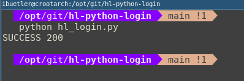
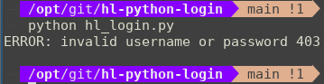

# hl-python-login
Helper script to login against a Hacking-Lab Tenant. SSO login is not supported!

## Installation
```
git clone https://github.com/Hacking-Lab/hl-python-login.git
cd ./hl-python-login
python -m venv venv
. ./venv/bin/activate
python -m pip install requests
```

## Configuration
You can store your `credentials` into a file called `config`. If the python script finds such a `config` file, it will take `tenant`, `username` and `password` from the config file. 

If you do not have or want such a config file, the python script will ask for `tenant`, `username` and `password` via command-line options

## Sample Configuration
```
[DEFAULT]
defaultLogin = compass

[compass]
tenant = compass
username = dmeier 
password = <removed>

[ost]
tenant = ost
username = kloher
password = <removed>

[hslu]
tenant = hslu
username = kroth
password = <removed>
```

## Example SUCCESS (valid credentials)
```
> python hl_login.py
SUCCESS 200
```




## Example ERROR (invalid credentials)
```
> python hl_login.py
ERROR: invalid username or password 403
```



## Disclaimer
The script does **NOT** work with the SSO (federated logins) service. It will only work for `local` logins on a tenant. 


